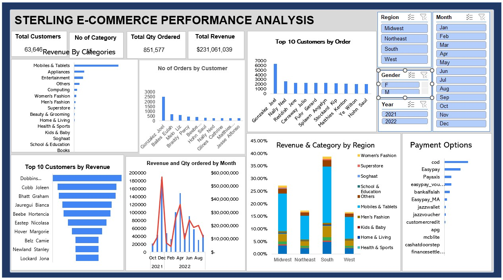
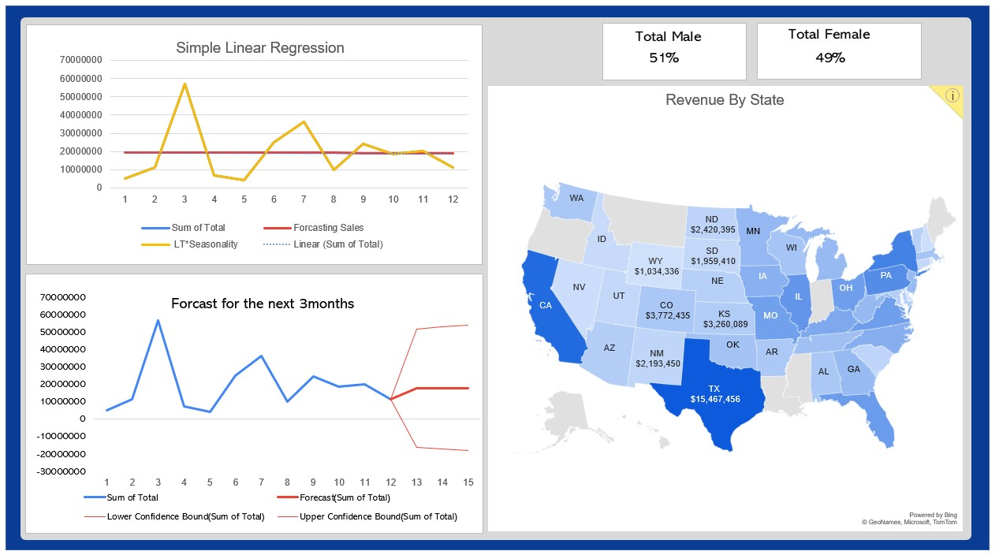

# Sterling E-Commerce Sales Performance Analysis

## Table of Contents
- [Project Overview](#project-overview)
- [Data Sources](#data-sources)
- [Data Handling](#data-handling)
- [Data Visualization](#Data-Visualization)
- [Conclusion](#conclusion)
- [Recommendations](#recommendations)

## Project Overview
This project aimed to analyze Sterling E-Commerce's sales data to uncover trends, regional performance, and product demand patterns. The findings emphasize the importance of 
targeted marketing, inventory adjustments, and customer engagement strategies. Overall, the project offers a comprehensive understanding of sales dynamics and serves 
as a foundation for informed business decisions and strategic improvements.

## Data Sources
The dataset used in this project was provided by 10Alytics. The key features are Category, City,	County,	Cust Id,	Customer Since,	Date of Order, Full Name	Gender,
Item Id, Order Id, Payment Method,	Place Name,	Ref Num,	Region,	State,	User Name, Qty Ordered,	Total

## Data Handling
The data was cleaned and preprocessed to ensure accuracy and consistency. This involved handling missing values, correcting inconsistencies in categorical
variables such as City, State, and Payment Method, and converting data types where necessary. 

## Data Visualization

## Conclusion
This project provided valuable insights into Sterling E-Commerce’s sales performance, highlighting key patterns and regional differences. These insights serve as a roadmap 
for future decision-making, positioning the company to better meet customer demands and capitalize on growth opportunities. With further study, there is potential to unlock even 
greater efficiencies and market expansion.

## Recommendation
- The company should leverage the success from December, the highest sales month in 2021, by analyzing the key factors behind this performance. Allocate resources and marketing strategies to replicate these factors
  throughout the year.
- Increase focus on selling products in the South and Midwest regions, where demand has been stronger.
- Implement more sales incentives nationwide to boost overall sales performance.
- Reduce stock levels for underperforming products to free up capital for higher-demand items, ensuring healthier cash flow.
- Prioritize stocking top-performing categories, as they have consistently driven sales and possibly revenue.
- Introduce loyalty programs or exclusive incentives to reward top customers to encourage repeat purchases.
- Conduct further research to understand why certain low-performing products are not being purchased and address these barriers.
- Study the reasons behind the low patronage outside the South and Midwest regions to improve performance in other areas.

